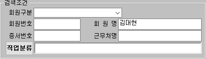
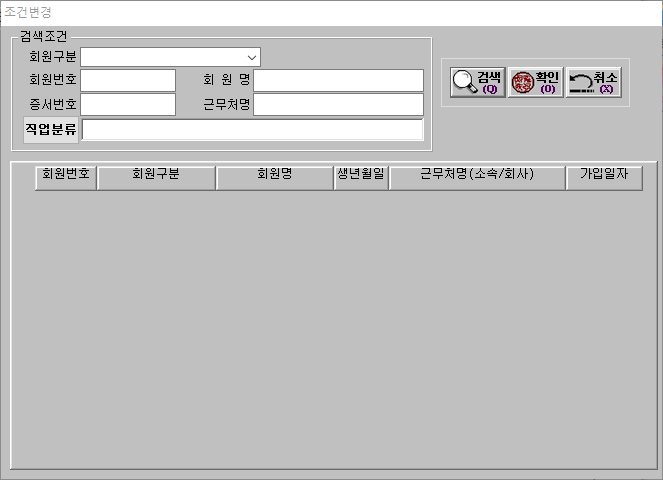
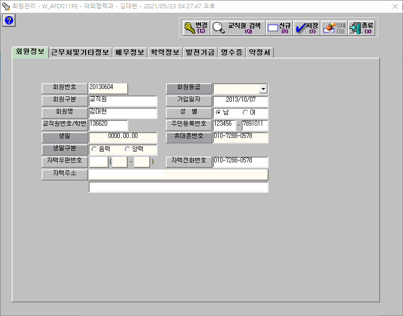
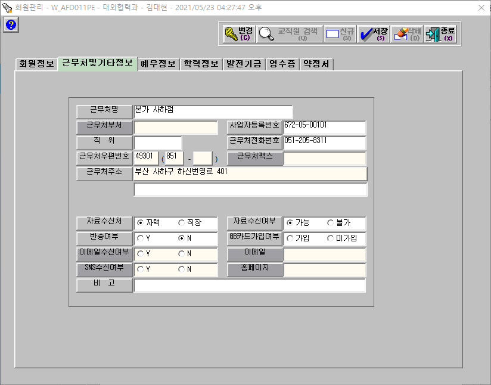
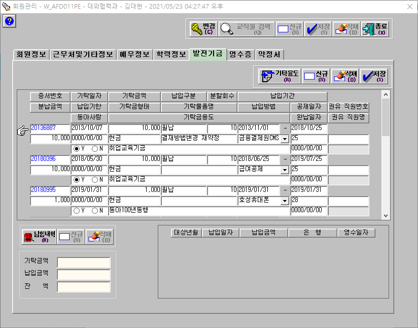
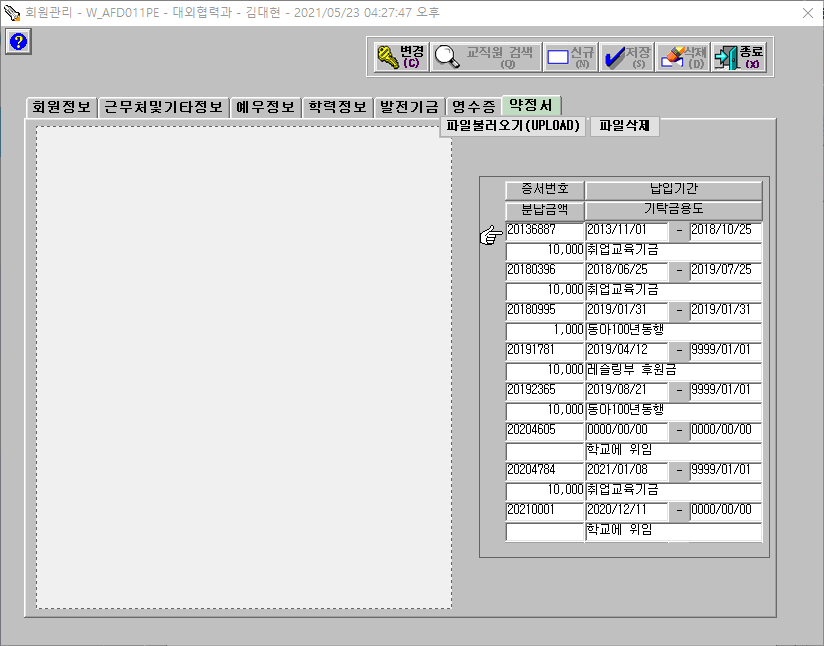
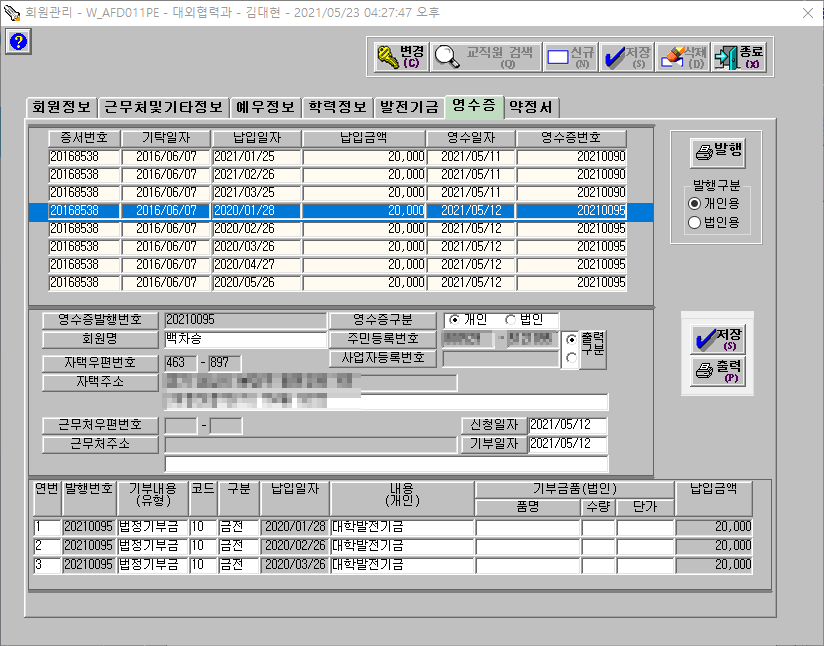

# :blue_book: 목차
## [Background](#one-Background)
- [대학 발전기금 시스템](#1-대학-발전기금시스템)
- [과업지시서](#2-과업지시서)
- [외부연동계획](#3-외부-연동계획)
- [키오스크와의 연동](#4-키오스크와의-연동)
## [프론트 페이지](#two-프론트-페이지)
- [메인](#1-메인)
- [기부하기](#2-기부하기)
- [기부 프로그램](#3-기부-프로그램)
  - [일반 기부 프로그램](#가-일반-기부-프로그램)
  - [단과대/학과지원](#나-단과대학과지원)
- [기부유형](#4-기부유형)
- [기부자 라운지](#5-기부자-라운지)
- [메뉴 외 페이지](#6-메뉴-외-페이지)
- [메뉴](#7-메뉴)
- [기타](#8-기타)
- [XD 가이드 문서](#9-xd-가이드-문서)
## [관리자 페이지](#three-관리자-페이지)  
- [대시보드](#1-대시보드)  
- [기부관리](#2-기부관리)
  - [약정서 관리](#가-약정서-관리)
  - [결제/승인 내역](#나-결제승인-내역)
  - [납입관리](#다-납입관리)
  - [발전기금시스템 조회](#라-발전기금시스템-조회)
  - [기부금영수증 발급내역](#마-기부금영수증-발급내역)
- [기부 프로그램 관리](#3-기부-프로그램-관리)
- [메세징 관리](#4-메세징-관리)
- [전자모금함 관리](#5-전자모금함-관리)
- [기부자 예우](#6-기부자-예우)
- [컨텐츠 관리](#7-컨텐츠-관리)
  - [기부소식](#가-기부소식)
  - [간행물](#나-간행물)
  - [협약서](#다-협약서)
  - [후원의 집](#라-후원의-집)
- [관리자 관리](#8-관리자-관리)
  - [관리자 권한부여](#가-관리자-권한-부여)
- [개인정보 관리](#9-개인정보-관리)
  - [개인정보 제3자 동의내역](#가-개인정보-제3자-동의내역)
  - [개인정보 수집 이용 동의내역](#나-개인정보-수집-이용-동의내역)
  - [개인정보 조회내역](#다-개인정보-조회내역)
## [제거된 기능](#four-제거된-기능)
## [추가된 기능](#five-추가된-기능)

   

# :one: Background
## 1. 대학 발전기금시스템
### 가. 시스템 화면

## 2. 과업지시서
## 3. 외부 연동계획
## 4. 키오스크와의 연동
# :two: 프론트 페이지
## 1. 메인
- 메인비쥬얼 구현 벤치마킹  
[롯데캐슬 홈페이지](https://www.lottecastle.co.kr/main/index.do)
## 2. 기부하기
### 가. 기부하기
### 나. 약정서
### 다. 전자서명
### 라. 결제완료/약정완료
## 3. 기부 프로그램
### 가. 일반 기부 프로그램
### 나. 단과대/학과지원
## 4. 기부유형
## 5. 기부자 라운지
### 가. 기부소식
### 나. 간행물
### 다. 모금현황
### 라. 기부자 예우
### 마. 세제혜택
### 바. 기부내역 조회
### 사. 기부금영수증
## 6. 메뉴 외 페이지
### 가. 본인인증
### 나. 주소변경
#### 1) 배송일련번호
#### 2) 주소변경 선택
#### 3) 개인정보 변경
### 다. 로그인
## 7. 메뉴
## 8. 기타
### 레이어 팝업
### 서브메뉴 구현
- 서브메뉴 가로스크롤 구현  
[네이버 스마트어라운드 벤치마킹](https://s.search.naver.com/p/around/search.naver)
### 팝업 알림
## 9. XD 가이드 문서   

# :three: 관리자 페이지
## 1. 대시보드
## 2. 기부관리
### 가. 약정서 관리
페이지에서 작성된 약정서만을 관리하는 페이지  
최초 기부약정시 회원번호, 증서번호가 없음 (기존회원일지라도 회원번호 없음)
#### 1) 발전기금시스템으로 전송 (발전기금시스템 중 회원/증서만)
- 회원번호 부여 (확인조건 성명, 생년월일 앞 6자리, 휴대폰번호)  
  - 기존회원일 경우 회원번호 생성 없이 기존회원번호 사용자가 입력한 회원정보로 발전기금시스템 정보 갱신  
  - 신규회원일 경우 회원번호 생성 후 사용자가 입력한 회원정보를 발전기금시스템으로 전송
- 증서번호 부여
회원번호 내 증서번호의 중복 등록만 방지되면 됨
- 전송완료후 각 약정서에 회원번호와 증서번호가 부여되어 출력됨
#### 2) 엑셀다운로드
- 전체 필드내용은 별도 제공
#### 3) 서면약정서
- 서면약정서는 전자서명이 들어가지 않음
- 서면약정서 스캔본 업로드 필요 (금융결제원에서 기부자 자동이체 동의내역(서명) 증빙요청 대응하기 위함)
- 다운로드 기능: 전자약정서와 서면약정서는 PDF로 다운 가능해야 함
### 나. 결제/승인 내역
별도 내역 전송 없이 홈페이지에서 데이터 보관 (납입관리에서 전송)
이 내역에는 증서번호가 있는 승인/결제내역과 증서번호가 없는 승인/결제 내역이 있음
#### 1) 출력할 데이터
- 결제방법 옵션에 있는 데이터 (무통장입금, 자동이체, 카드결제, 카카오페이)
#### 2) 수집 데이터
- 카드/PG 아임포트 수집
- VAN 키오스크에서 전송
- 급여공제, 자동이체, 무통장입금은 엑셀업로드
- 엑셀업로드 시 관리자가 웹약정번호와 연동시켜버림? 그러면 발전기금 시스템 생성 이후의 데이터만 관리 가능한데?)
### 다. 납입관리
링크허브 계좌조회 API 이용  
이 페이지에는 전송된 납입내역과 전송되지 않은 납입내역 존재
#### 거래내역 - 결제/승인내역 연결 (오류방지를 위한 메모)
- 1개 거래내역 당 1개의 결제/승인내역
  - 무통장입금
- 1개 거래내역 당 다수의 결제/승인 내역  
이 입금건들은 수수료를 제외하고 입금되는 내역이라 각 건마다 수수료 금액을 관리자가 입력할 수 있어야 함
또는 금액이 딱 맞지 않아도 물려질 수 있어야 함
  - 금융결제원 자동이체
  - PG (나이스페이, 카카오페이, 네이버페이)
  - VAN (키오스크)
#### 발전기금 시스템 전송
- 거래내역 아래에 증서번호가 있는 결제/승인내역이 물리면 발전기금시스템 전송가능
- 발전기금시스템 전송 시 중복데이터가 있는지 확인
### 라. 발전기금시스템 조회
대학 발전기금시스템 캡처화면과 동일한 구조로 조회 가능하게 함
회원명으로 검색해서 상세내역 조회 하는 방식
#### 데이터 구조
- 회원번호
  - 개인정보/법인정보 (단일 데이터)
  - 증서번호 (복수 데이터)
    - 납입내역 (복수 데이터)
  - 기부금 영수증
### 마. 기부금영수증 발급내역
시스템상 최근 발급된 내역을 기계적으로 뿌려줌  
국세청 전송관련 기능 구현은 보류 (추가 발주시 진행)

## 3. 기부 프로그램 관리
#### 단과대학만 선택 가능, 단과대학만 선택했을 경우 최상단에 위치, 중복
#### 단과대 학과지원의 순서는 어떻게 정리할지에 대한 고민 필요함

## 4. 메세징 관리
### 가. 카카오 알림톡 (이외는 구현하지 않음)
링크허브 카카오 알림톡 SDK를 이용 
링크허브 사이트에서 관리할 수 있다면 알림톡 자동발신과 발신내역만 구현해도 됨
#### 1) 자동발신
- 기부성공 시 카카오 알림톡
- 미완성 정보에 대한 완성 알림톡
- 추후 기부종료시 카카오 알림톡 구현 (추가 발주 시 진행)
#### 2) 발신내역
- 발신된 내역을 테이블형태로 조회 할 수 있어야 함
### 나. 문자메세지: 구현하지 않음

## 5. 전자모금함 관리
### 가. 기기설정/현황
모금내역은 전자모금함과 약정현황 모두에 출력한다
## 6. 기부자 예우
### 가. 예우대상자 풀
기부자 리스트 출력 금액 순, 최신순 정렬  
기부자리스트는 직접 들고오고 기타 리스트는 엑셀 업로드
#### 1) 우편발송 생성
#### 2) 행사초청 생성 (추가 발주시 진행)
### 나. 우편발송관리
생성된 우편발송을 관리 반송 등
### 다. 행사초청관리
구현하지 않음

## 7. 컨텐츠 관리
에디터는 CKEditor5로 구현. 패키지 별도 제공 링크

### 가. 기부소식
#### 1) 분류
- 기부소식, 동아뉴스, 동아는 지금, 기부스토리
#### 2) 입력필드
- 제목
- 취재 (기본값: 대외협력과 장소영)
- 사진 (기본값: 대외협력과 신부삼)
- 입력일자 (Datepicker)  
yyyy-mm-dd 형식으로 사용자가 직접입력도 가능하게 구현  
실제 입력/수정일시는 DB에 저장
#### 3) 업로드  
- 썸네일 이미지(썸네일)
#### 4) 기타사항
- 썸네일 이미지와 별도로 CKEditor 내에서 본문안에 여러 사진을 삽입 할 예정

### 나. 간행물
#### 1) 입력필드
- 제목
#### 2) 첨부파일
- 간행물 pdf 파일
- 썸네일 이미지
#### 3) 기타사항
- 실제 입력/수정일시는 DB에 보관
### 다. 협약서
#### 1) 입력필드
- 체결번호: 관리자가 텍스트 직접 입력 (ex 2021-0001)
- 제목
- 상대기관
- 주관부서
- 체결일자 (Datepicker)  
yyyy-mm-dd 형식으로 사용자가 직접입력도 가능하게 구현  
실제 입력/수정일시는 DB에 저장
#### 2) 첨부파일
- 협약서 pdf
- 썸네일 이미지
### 라. 후원의 집
#### 1) 작성 준비중
### 마. 영상 관리
### 바. 팝업 관리
## 8. 관리자 관리
개인정보 관련 준수를 위해 최소 필요사항만 구현
### 가. 관리자 권한 부여
- 관리자 메뉴 별 체크박스 선택하여 권한 부여 할 수 있게
- 접속 가능한 IP 설정 (실사용 때는 주석처리 예정, 개인정보 실사 할 때 실제 코드 캡처, 작동화면을 요구함)
- 60분 후 자동 로그아웃 (실사용 때는 주석처리 예정, 개인정보 실사 할 때 실제 코드 캡처, 작동화면을 요구함)
- 권한 부여/변경/삭제 내역: 로그 기록 테이블, 시안 참고
## 9. 개인정보 관리
### 가. 개인정보 제3자 동의내역
시안 참고
### 나. 개인정보 수집 이용 동의내역
시안 참고
### 다. 개인정보 조회내역
- 관리자 조회기록 ID
- 생성일시
- IP
- 확인한 정보
- 수행업무(생성,수정,삭제,검색,출력)
- 다운로드시 출력사유
# :four: 제거된 기능
- 납입방법 별로 지정된 필드의 엑셀파일 다운로드 > 납입방법 별 동일한 필드의 엑셀파일 다운로드
- 문자메세지 SDK 미적용
- BIC 시스템 DB연동 미적용
- 통계 제거 > 구글 애널리틱스 스크립트 코드 삽입으로 대체
- 연/학기/월/일간 현황 제거
- 예우대상자 관리
  - 행사초청자 관리 제거
- 마라톤 홈페이지 마이그레이션 제거
- 감사인사 업로드 기능 제거 > 총장인사말로 간소화 (SFR-030)
- 연차보고서 E-Book 형태 제공(PDF.js) 제거 > 다운로드로만 제공
- 관리자 관리 (SFR-022)
  - 최고관리자. 운영관리자, 조회관리자, 우편발송 관리자, 행사초청 관리자, 모금함 관리자 등의 상세권한 부여 제거
  - 상세권한에 따른 접근가능 기능 부여 제거
- 기부프로그램별 모금현황 제거 (SFR-024 중 2번째 항목)

# :five: 추가된 기능
- ~~기부프로그램별 더보기 기능~~
- ~~담당자 안내~~
- ~~기부 아이디어 제안~~
