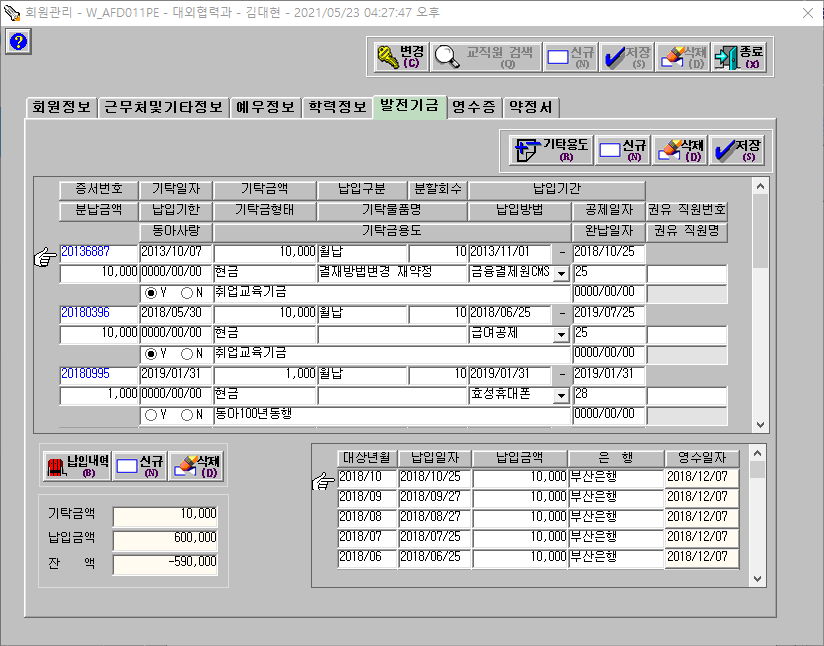

## :zero: XD 가이드 문서   
- https://xd.adobe.com/view/26be83b6-2348-4c67-ab75-79010b78b03e-73ed/
  - [버튼/박스/기타요소 바로가기](https://xd.adobe.com/view/26be83b6-2348-4c67-ab75-79010b78b03e-73ed/screen/16e5984f-0afa-47fe-9ab2-ca01317e9622/specs/)
  - [어플리케이션 바로가기](https://xd.adobe.com/view/26be83b6-2348-4c67-ab75-79010b78b03e-73ed/screen/0ec414bc-3a19-4355-8291-993fc2928279/specs/)
  - [전자서명 조건별 어플리케이션 바로가기](https://xd.adobe.com/view/26be83b6-2348-4c67-ab75-79010b78b03e-73ed/screen/45e7f72b-8444-4b69-9b5a-22f88d0e4999/specs/)
  - [약정서 조건별 어플리케이션 바로가기](https://xd.adobe.com/view/26be83b6-2348-4c67-ab75-79010b78b03e-73ed/screen/6b431cbf-c279-4e03-af8a-f6f5b02d736a/specs/)
- 이미지가 없으면 카카오톡 채팅방이나 박팀장님을 통해 전달주시면 전달 드리겠습니다.  
일반적으로 이미지들은 PC버전과 각 어플리케이션 페이지에서 익스포트 가능합니다.  
없는 이미지는 publishing_img 폴더도 확인 부탁드립니다. [바로가기 publishing_img.md](publishing/img/publishing_img.md)
- xd파일을 직접 확인하고자 하시면 adobe 계정을 알려주시면 초대하겠습니다.

# :blue_book: 목차
## [XD 가이드 문서](#zero-xd-가이드-문서)
## [Background](#one-Background)
- [대학 발전기금 시스템](#1-대학-발전기금시스템)
- [과업지시서](#2-과업지시서)
- [외부연동계획](#3-외부-연동계획)
- [키오스크와의 연동](#4-키오스크와의-연동)
## [프론트 페이지](#two-프론트-페이지)
- [메인](#1-메인)
- [기부하기](#2-기부하기)
- [기부 프로그램](#3-기부-프로그램)
  - [일반 기부 프로그램](#가-일반-기부-프로그램)
  - [단과대/학과지원](#나-단과대학과지원)
- [기부유형](#4-기부유형)
- [기부자 라운지](#5-기부자-라운지)
- [메뉴 외 페이지](#6-메뉴-외-페이지)
- [메뉴](#7-메뉴)
- [기타](#8-기타)
  - [레이어 팝업](#레이어-팝업)
  - [인풋박스 유효성 검사](#인풋-박스-유효성-검사)
  - [인풋박스 플로팅 라벨](#플로팅-라벨)
  - [서브메뉴 가로스크롤](#서브메뉴)
## [관리자 페이지](#three-관리자-페이지)  
- [대시보드](#1-대시보드)  
- [기부관리](#2-기부관리)
  - [약정서 관리](#가-약정서-관리)
  - [결제/승인 내역](#나-결제승인-내역)
  - [납입관리](#다-납입관리)
  - [발전기금시스템 조회](#라-발전기금시스템-조회)
  - [기부금영수증 발급내역](#마-기부금영수증-발급내역)
- [기부 프로그램 관리](#3-기부-프로그램-관리)
- [메세징 관리](#4-메세징-관리)
- [전자모금함 관리](#5-전자모금함-관리)
- [기부자 예우](#6-기부자-예우)
- [컨텐츠 관리](#7-컨텐츠-관리)
  - [기부소식](#가-기부소식)
  - [간행물](#나-간행물)
  - [협약서](#다-협약서)
  - [후원의 집](#라-후원의-집)
- [관리자 관리](#8-관리자-관리)
  - [관리자 권한부여](#가-관리자-권한-부여)
- [개인정보 관리](#9-개인정보-관리)
  - [개인정보 제3자 동의내역](#가-개인정보-제3자-동의내역)
  - [개인정보 수집 이용 동의내역](#나-개인정보-수집-이용-동의내역)
  - [개인정보 조회내역](#다-개인정보-조회내역)
## [제거된 기능](#four-제거된-기능)
## [추가된 기능](#five-추가된-기능)

   

# :one: Background
## 개요
발전기금 홈페이지 리뉴얼 프로젝트 입니다.  
- 핵심 구현사항
  - 기부자가 쉽게 기부하고, 그 내역을 확인 할 수 있으며 기부자 예우가 효율적으로 이루어져야 합니다.
   - 홈페이지에서는 홈페이지에서 생성된 정보와 키오스크에서 생성된 정보를 취합해 동아대학교 발전기금시스템 DB로 전송합니다.
## 약정과 결제
동아대학교는 기부행위를 약정과 결제 두가지 단계로 나누어 인식하며 두가지 모두가 이루어졌을 때 기부가 완료되었다고 인식합니다.
### 약정
- 기부자가 기부 의사를 구두, 전화, 문서, 전자적 입력을 통해 밝히는 것입니다.  
  일반 상거래에서 주문, 주문서 입력, 계약서 작성과 유사합니다.
### 결제
- 기부자가 밝힌 기부의사에 따라 기부금을 납입 하는 것 입니다.  
  일반 상거래에서 결제의 의미와 동일 합니다.
### 개발방향
- 홈페이지, 키오스크 모두 불가피한 상황을 제외하고는 기부자의 약정과 결제가 한번에 이루어 지도록 개발해야 합니다.
## 1. 대학 발전기금시스템
### 가. 시스템 화면
- 검색화면  

- 회원정보
  - 개인  

  - 법인  

- 증서조회  

- 납입내역  

- 약정서업로드  

- 기부금영수증  

## 2. 과업지시서
과업지시서 링크입니다. 작업시 본 가이드와 함께 참고하시기 바랍니다.  [[과업지시서_2020-12-21_발전기금_홈페이지_리뉴얼.pdf]](/과업지시서/과업지시서_2020-12-21_발전기금_홈페이지_리뉴얼.pdf)
## 3. 외부 연동계획
## 결제
### 결제API
- 아임포트 (https://www.iamport.kr/)
  - 복수의 결제대행사 이용시 효율적 개발과 유지보수를 위해 아임포트 이용예정
  - 참고자료
    - 대시보드 https://admin.iamport.kr/users/login
    - 개발가이드 https://www.iamport.kr/getstarted
    - 연동매뉴얼 https://docs.iamport.kr/
    - Github https://github.com/iamport
    - API문서 https://api.iamport.kr/
    - 결제DEMO https://www.iamport.kr/demo
  - 적용대상
    - 나이스페이 PG, 카카오페이, 네이버페이

### 결제수단
전체 결제수단의 개요정보입니다. 상세적용은 홈페이지, 키오스크간 상이할 수 있으니 아래쪽 관련내용과 함께 참조하시기 바랍니다.
#### 기부방식별 결제수단

[엑셀파일: 기부방식별 결제수단 상세.xlsx](etc/기부방식별_결제수단_상세_2021-05-25.xlsx)
#### 자동이체
- 결제대행사: 금융결제원CMS
- 프로세스
  1. 관리자 약정내역 엑셀 다운로드(웹 관리자 페이지)
  2. 금융결제원 업로드
  3. 이체결과 관리자 웹 업로드
  4. 결제내역 
#### 신용카드 (PG, 정기결제)
- 결제대행사: 나이스페이(PG, 가입예정)
- REST API방식  
  https://docs.iamport.kr/implementation/subscription  
  https://github.com/iamport/iamport-manual/blob/master/%EB%B9%84%EC%9D%B8%EC%A6%9D%EA%B2%B0%EC%A0%9C/example/nice-request-billing-key.md
#### 신용카드 (현장 일시불 결제)
- 결제대행사: KSNet(VAN, 가입예정)
- KSNET 제공 결제모듈 이용
- 키오스크에서만 지원하는 결제 방식
- 기부자에게 할부 수수료가 발생하므로 할부결제 이용하지 않음  
  분납 이용하고자 하는 기부자는 신용카드 정기결제로 처리
#### 카카오페이 (일시/정기결제)
- 결제대행사: 카카오페이(PG, 가입예정)
- 아임포트 이용
  - 일시결제 https://github.com/iamport/iamport-manual/blob/master/%EC%9D%B8%EC%A6%9D%EA%B2%B0%EC%A0%9C/sample/kakao.md
  - 정기결제 https://github.com/iamport/iamport-manual/blob/master/%EB%B9%84%EC%9D%B8%EC%A6%9D%EA%B2%B0%EC%A0%9C/example/kakaopay-request-billing-key.md
- 참고자료  
  - 카카오페이 개발자 센터 https://developers.kakao.com/docs/latest/ko/kakaopay/common
- 유사 웹페이지 적용 사례
  - 서원대학교 발전기금 홈페이지 (일시/정기기부 적용) https://with.seowon.ac.kr/with/fund/step?menuId=MENU00353
  - 푸르메 재단 (일시기부 적용) https://purme.org/donation-apply

#### 썸패스 (일시결제)
- 결제대행사: 썸뱅크(직접 이체방식)
- 썸패스는 키오스크에만 적용 예정입니다.
- 결제완료 결과를 수신할 수 있는지 확인해야 합니다.
- 부산은행 디지털사업부와 관련 문서, API제공에 대한 협의 예정입니다.
- 홈페이지에 네이버페이 적용 불가시 썸패스 적용 가능여부 검토예정입니다.
#### 네이버페이 (일시/정기결제)
- 결제대행사: 네이버페이 (PG, 가입예정)
- 네이버페이는 홈페이지만 적용 예정입니다.
  - 향후 적용여부 판단계획(홈페이지)
    - 아임포트측과 협의 후 적용 가부 판단
    - 아임포트 적용 불가시 직접 네이버페이 구현 여부 판단
    - 네이버페이 최종 적용 불가 판단 시 썸패스의 웹페이지 적용여부를 검토
    - 네이버페이, 썸패스 모두 웹 적용 불가 판단시 웹은 두가지 모두 구현하지 않음
- 아임포트 이용
  - 일시결제 https://github.com/iamport/iamport-manual/blob/master/NAVERPAY/sample/naverpay-pg.md
  - 정기결제 https://github.com/iamport/iamport-manual/blob/master/NAVERPAY/sample/naverpay-recurring.md
- 참고자료
  - 네이버페이 개발자 센터  
  일시결제 https://developer.pay.naver.com/docs/v2/api#payments-payments_flow  
  정기결제 https://developer.pay.naver.com/docs/v2/api#recurrent-recurrent_summary
- 유사 웹페이지 적용 사례
  - 굿네이버스 https://www.goodneighbors.kr/support_pay/regular.gn
  - 유니세프 https://www.unicef.or.kr/donation/?TrackCode=pc_donation_btn

## 4. 키오스크와의 연동
### 키오스크 개발 정보
- 키오스크 개발자 가이드 https://github.com/fund-donga/kiosk/blob/main/Dev_guide_kiosk.md
- 키오스크 프로토 타입
  - QR코드 모드  
https://xd.adobe.com/view/d6e5840b-81a8-4ae9-824b-e48f9038e902-83b6/
  - 전화번호 모드  
https://xd.adobe.com/view/0e93af62-ed1d-49b2-bbdf-8b188ff8de02-5bc0/
  - 전체페이지  
  https://xd.adobe.com/view/0e93af62-ed1d-49b2-bbdf-8b188ff8de02-5bc0/
### 기본 통신방식
- 프로토콜 http, 형식 json
- 참고자료 https://stackoverflow.com/questions/5725430/http-test-server-accepting-get-post-requests
### 홈페이지 - 키오스크 연동 상세
- 홈페이지
  - 키오스크가 제출하는 약정/결제정보를 수신하고 불완전정보일 경우 약정서를 완성할 수 있는 URL을 키오스크에 리턴해 줍니다.
- 키오스크
  - 홈페이지에 카드사 식별을 위한 BIN 정보를 제공합니다.
  - 홈페이지에 약정/결제정보를 송신합니다. 불완전정보일 경우 리턴되는 URL을 기부자에게 문자메세지로 발송해서 기부자가 정보를 완성할 수 있게 합니다.
## 5. PG 가입을 위한 퍼블리싱
각 PG사는 결제 사고 예방을 위해 결제금액을 사용자가 직접입력할 경우 이용승인/검수 시 승인을 내주지 않고 있습니다.  
따라서 개발 시 약정서 페이지에서는 시안과 같이 특정금액만 선택하게끔 개발하여 처리하고 text form은 사용자의 직접입력을 막은 채로 승인신청 할 예정입니다.  
전체 PG사의 승인 완료 이후에는 text form에 사용자의 직접입력을 허용할 예정입니다.
# :two: 프론트 페이지
## 1. 메인
- 메인비쥬얼 구현 벤치마킹  
롯데캐슬 홈페이지 https://www.lottecastle.co.kr/main/index.do
## 2. 기부하기
### 가. 기부하기
기본적으로 사용자는 로그인을 하지 않습니다.
메뉴바 우측 상단에 위치한 기부하기 버튼 클릭시 이동하는 페이지입니다.
### 나. 약정서
- 약정서 작성 페이지 입니다. 시안을 참고해 주십시오.
- SSO로 넘어오는 교직원/학생은 로그인 상태여야 합니다.
- 유효성 검사
  - 필수 입력필드의 유효성 검사, 주민번호/외국인등록번호/사업자등록번호의 유효성 검사
  - 예금주 유효성 검사
    - 링크허브 SDK를 통해 구현합니다. https://www.linkhub.co.kr/Downloads/EasyFinAccount/1779?PageNum=1
    - [SDK 바로가기](/sdk/linkhub/)
  - 교직원/학생 정보 점검
### 다. 전자서명
전자서명 페이지 입니다.
#### 카카오페이 전자서명
- 링크허브를 통해 카카오페이 전자서명을 구현합니다.
- 참고자료 https://www.linkhub.co.kr/Downloads/ESign/1751?PageNum=1
- [SDK 바로가기](/sdk/kakaopay_cert-sign/)
#### signaturePAD
- 일반 전자서명은 signaturePAD JS라이브러리를 이용합니다.
- 참고자료 https://github.com/szimek/signature_pad
### 라. 결제완료/약정완료
- 약정완료 페이지: 무통장입금, 계좌이체(별도 문구가 나올예정)
- 결제완료 페이지: 무통장입금, 계좌이체 이외의 승인완료 된 결제
## 3. 기부 프로그램
### 가. 일반 기부 프로그램
### 나. 단과대/학과지원
- 초기화면 공백
- 단과대만 선택시 관리자페이지에서 단과대학만 설정된 프로그램 출력
- 단과대 - 학과 동시 선택시 관리자페이지에서 단과대학 - 학과 동시 설정된 프로그램 출력
## 4. 기부유형
- 메뉴에서 클릭시 해당 컨텐츠의 위치로 이동되어야 함
## 5. 기부자 라운지
### 가. 기부소식
### 나. 간행물
### 다. 모금현황
연간 모금현황 페이지 입니다.
차트구현은 예시를 참고해 주시기 바랍니다. [바로가기 /publishing/chart/chart_example.html](/publishing/chart/chart_example.html)
### 라. 기부자 예우
### 마. 세제혜택
### 바. 기부내역 조회
### 사. 기부금영수증
## 6. 메뉴 외 페이지
### 가. 본인인증
- 링크허브를 통해 구현합니다. https://www.kakaocert.com/SDKDown
- [SDK 바로가기](/sdk/kakaopay_cert-sign/)
### 나. 주소변경
#### 1) 배송일련번호
#### 2) 주소변경 선택
#### 3) 개인정보 변경
### 다. 로그인
## 7. 메뉴
## 8. 기타
### 레이어 팝업
구현 완료되었으므로 별도 코멘트 없습니다.
### 인풋 박스 유효성 검사
기본적으로 클라이언트 사이드로 개발해 주시기 바랍니다.  
불가피 한 경우에만 서버 사이드로 구현해 주십시오. (ex 계좌번호 유효성 검사)

- 부트스트랩5 벤치마킹  
https://getbootstrap.com/docs/5.0/forms/validation/#supported-elements

- 클라이언트 사이드 (우선)
  - Jquery 라이브러리 (선택)  
https://jqueryvalidation.org/  (다기능)  
https://www.jqueryscript.net/form/Form-Validation-Plugin-jQuery-Validity.html  (가벼움)

- 서버 사이드
  - 일반 form
    - PHP 라이브러리  
https://github.com/Respect/Validation  
https://github.com/Wixel/GUMP

- 일반적으로 라이브러리에 포함 되어있지 않은 유효성 검사  
- 계좌번호 유효성 검사
    - 링크허브 SDK를 통해 구현합니다. https://www.linkhub.co.kr/Downloads/EasyFinAccount/1779?PageNum=1
      - [SDK 바로가기](/sdk/linkhub/)
- 주민/외국인번호, 사업자번호 유효성 검사
  - https://github.com/bluedisk/django-korean-fields/blob/master/korean/static/korean/js/jumin.js
  - https://github.com/bluedisk/django-korean-fields/blob/master/korean/static/korean/js/saup.js

  - https://eyecandyzero.tistory.com/240
  - https://github.com/kenu/egov/blob/master/ok.commoncomp/src/main/java/egovframework/com/utl/fcc/service/EgovNumberCheckUtil.java
  - https://github.com/joonolee/framework2/blob/master/framework2/src/framework/util/ValidationUtil.java

  - https://greensul.tistory.com/51
  - https://blog.naver.com/gang5991/222205092055
  

~~- 참고사이트~~  
~~https://codepen.io/thehoneycroissant/pen/qwmdGW~~  
~~https://medium.com/@daniwhkim/easy-form-validation-with-ajax-load-and-php-6ed530a7fc9d~~  
~~http://reusableforms.com/d/e1/php-contact-form-with-validation~~  
~~https://www.positronx.io/php-form-validation/~~  
~~https://github.com/voku/HtmlFormValidator~~

~~- 기타 참고~~  
~~https://www.w3schools.com/php/php_form_validation.asp~~  
~~https://eastflag.co.kr/frontend/html5_api/html5-bootstrap-validation/~~  
~~http://jun.hansung.ac.kr/SWP/PHP/PHP%20Form%20Validation.html~~
### 플로팅 라벨
- 부트스트랩5 벤치마킹  
https://getbootstrap.com/docs/5.0/forms/floating-labels/
- 참고사이트  
https://github.com/anydigital/float-label-css  
https://aosceno.tistory.com/403
### 서브메뉴
- 서브메뉴 가로스크롤 구현  
  - 네이버 스마트어라운드 벤치마킹  
  https://s.search.naver.com/p/around/search.naver
### 팝업 알림
이미 구현되었으므로 별도 코멘트 없습니다.

# :three: 관리자 페이지
## 1. 대시보드
## 2. 기부관리
### 가. 약정서 관리
홈페이지와 키오스크에서 작성된 약정서를 관리하는 페이지  
최초 기부약정시 회원번호, 증서번호가 없음 (현 상태에서는 기존회원일지라도 회원번호 없음)  
생성된 증서들은 웹 약정번호가 생성됨
#### 1) 키오스크의 정보 수신
- 키오스크에서 전송된 데이터들도 전송받으면 웹 약정번호가 생성됨
- 키오스크로 부터 받는 약정 데이터
  - 정상 데이터
    - 학생/교직원들의 QRCode를 이용해 약정한 데이터
  - 불완전 데이터
    - 전화번호로만 약정한 데이터
    - 웹 약정번호에 따른 URL을 키오스크에 리턴해주어 키오스크가 사용자에게 URL을 안내해 줄 수 있어야함
    - 이용자가 웹 약정번호 URL로 접속해서 정보입력 후 정상 데이터가 되면 웹약정번호에 따른 주소는 접근이 불가능해야 함 (안내메세지 출력 후 발전기금 홈페이지로 리다이렉트)
#### 2) 발전기금시스템으로 전송 (발전기금시스템 중 회원/증서만)
- 회원번호 부여 (확인조건 성명, 생년월일 앞 6자리, 휴대폰번호)  
  - 기존회원일 경우 회원번호 생성 없이 기존회원번호 사용자가 입력한 회원정보로 발전기금시스템 정보 갱신  
  - 신규회원일 경우 회원번호 생성 후 사용자가 입력한 회원정보를 발전기금시스템으로 전송
  - 키오스크로 부터 받은 불완전 데이터는 완성전까지 발전기금시스템으로 전송 불가
- 증서번호 부여
회원번호 내 증서번호의 중복 등록만 방지되면 됨
- 전송완료후 각 약정서에 회원번호와 증서번호가 부여되어 출력됨
#### 3) 엑셀다운로드
- 전체 필드내용은 별도 제공
#### 4) 서면약정서
- 서면약정서는 전자서명이 들어가지 않음
- 서면약정서 스캔본 업로드 필요 (금융결제원에서 기부자 자동이체 동의내역(서명) 증빙요청 대응하기 위함)
- 다운로드 기능: 전자약정서와 서면약정서는 PDF로 다운 가능해야 함
### 나. 결제/승인 내역
별도 내역 전송 없이 홈페이지에서 데이터 보관 (납입관리에서 전송)
이 내역에는 증서번호가 있는 승인/결제내역과 증서번호가 없는 승인/결제 내역이 있음
#### 1) 출력할 데이터
- 결제방법 옵션에 있는 데이터 (무통장입금, 자동이체, 카드결제PG/VAN, 카카오페이, 썸패스)
#### 2) 수집 데이터
- 카드/PG 아임포트 수집
- VAN 키오스크에서 전송
- 썸패스 키오스크에서 전송 (썸패스는 승인번호가 없을수 있습니다.)
- 급여공제, 자동이체, 무통장입금은 엑셀업로드 (어떤방식으로 업로드할지에 대한부분은 추후 논의, 성명 생년월일 전화번호 등으로 매칭 검토)
### 다. 납입관리
- 링크허브 계좌조회 API 이용  https://www.linkhub.co.kr/Downloads/EasyFinBank/1124?PageNum=1  
[SDK 바로가기](/sdk/linkhub/)
- 이 페이지에는 발전기금시스템으로 전송된 납입내역과 전송되지 않은 납입내역 존재
#### 거래내역 - 결제/승인내역 연결 (오류방지를 위한 메모)
- 1개 거래내역 당 1개의 결제/승인내역
  - 무통장입금
- 1개 거래내역 당 다수의 결제/승인 내역  
  - 금융결제원 자동이체
  - PG (나이스페이, 카카오페이, 네이버페이)
  - VAN (키오스크)
  - 추가 코멘트
    - 이 입금건들은 수수료를 제외하고 입금되는 내역입니다.  
      따라서 각 건마다 수수료 금액을 관리자가 입력할 수 있어야 합니다.  
      > 통장 거래내역 금액 = 복수의 결제/승인내역 금액의 합 + 수수료  
      
      구현이 불가능할 경우 금액이 딱 맞지 않아도 물려질 수 있어야 합니다.

#### 발전기금 시스템 전송
- 거래내역 아래에 증서번호가 있는 결제/승인내역이 물리면 발전기금시스템 전송가능
- 발전기금시스템 전송
  - 전송 이전에 중복데이터가 있는지 확인합니다.
  - 기본적으로 거래내역의 데이터를 전송하지만 납입일자는 계좌에 입금된 일자를 전송합니다.
### 라. 발전기금시스템 조회
대학 발전기금시스템 캡처화면과 동일한 구조로 조회 가능하게 함  
회원명으로 검색해서 상세내역 조회 하는 방식  
상단 발전기금 시스템 화면 캡처와 함께 참고해 주시기 바랍니다.  [바로가기](#가-시스템-화면)
#### 데이터 구조
- 회원번호
  - 개인정보/법인정보 (단일 데이터)
  - 증서번호 (복수 데이터)
    - 납입내역 (복수 데이터)
  - 기부금 영수증
### 마. 기부금영수증 발급내역
시스템상 최근 발급된 내역을 기계적으로 뿌려줌  
국세청 전송관련 기능 구현은 보류 (추가 발주시 진행)

## 3. 기부 프로그램 관리
### 기부 프로그램 신규등록/수정
- 프로그램명
  - 텍스트 입력
- 활성화여부
  - 라디오버튼: 활성화/비활성화
- 기부방식
  - 체크박스 - 정기기부, 일시기부, 분할납부
- 납입방법
  - 수단: 무통장입금, 자동이체, 신용카드, 카카오페이, 네이버페이
  - 기부방식이 일시기부 단독 선택하였는데 자동이체를 선택하는 등의 액션은 무시하고 작동가능한 범위만 설정 되면 됩니다.
- 노출분류
  - 체크박스: 주요 캠페인 지원, 학생 지원, 연구 지원, 단과대/학과 지원, 대학생활 지원
  - 원칙적으로 모든 기부프로그램에 노출 설정 할 수 있습니다.
- 기부금액 지정
  - 라디오 버튼: 지정, 비지정
- 기부금액
  - 기부금액 지정 필드가 지정으로 설정되었을 때만 유효합니다.
- 단과대/학과 분류
  - 셀렉트박스: 단과대학 선택, 학과 선택
  - 단과대학만 선택 가능하나 학과만 선택하는 것은 불가능 합니다.
- 발전기금 코드
  - 텍스트입력: 대학발전기금시스템 내 발전기금 코드를 검색해서 입력합니다.
  - 발전기금시스템 발전기금 코드는 약정서를 전송할때 반드시 필요한 정보입니다.  
하지만 발전기금 코드를 입력하지 않으면 하여 홈페이지에서 모금이 불가한 것은 아닙니다. (최초 약정서가 생성 된 후 발전기금 시스템 전송 전 입력가능)
  - 홈페이지 내 프로그램명과 발전기금시스템 내 발전기금 명은 다를 수 있고 시스템에서는 시스템 내 프로그램명으로 적립 됩니다.  
   예를들어 홈페이지내 프로그램명이 동아100년동행인데 발전기금코드 600 동아101년동행으로 설정하면 발전기금은 최종적으로 발전기금시스템에는 코드 600 동아101년동행으로 적립됩니다.
  - 홈페이지 내 복수의 기부 프로그램이 1개의 코드를 지닐 수 있습니다.  
  (ex. 동아99년동행 > 600 동아101년동행, 동아100년동행 > 600 동아101년동행)
  - 발전기금 코드 내 정보
    - 프로그램명, 발전기금 코드, 관련 학과, 기타정보
- 아이콘 업로드
  - 각 기부프로그램 마우스호버 액션 카드에 들어갈 아이콘을 업로드 합니다.
- 이미지 업로드
  - 썸네일, 기부프로그램별 메인비쥬얼에 들어갈 이미지를 업로드 합니다.
- 설명텍스트
  - 테스트 후 3~4줄 미만의 글자수 제한 된 기부프로그램 설명 텍스트를 입력합니다.
### 기부 프로그램 리스트
#### 전체보기
- 기부프로그램의 현황을 요약하여 보여줍니다.
- 대학 발전 전반 지원은 여기에만 표시됩니다.
- 프로그램명을 검색 할 수 있어야 합니다.
- 전체 프로그램을 엑셀로 다운로드 할 수 있어야 합니다.
#### 카테고리별 보기
- 각 기부프로그램 현황 조회
- 기부프로그램 출력 순서를 조정 할 수 있어야 합니다.

## 4. 메세징 관리
### 가. 카카오 알림톡 (이외는 구현하지 않음)
링크허브 카카오 알림톡 SDK를 이용 https://www.linkhub.co.kr/Downloads/KakaoTalk/644?PageNum=1  
링크허브 사이트에서 관리할 수 있다면 알림톡 자동발신과 발신내역만 구현해도 됨
#### 1) 자동발신
기부방식별 결제00수단과 함께 살펴봐 주십시오. [기부방식별 결제수단](#기부방식별-결제수단)
- 기부성공 시 카카오 알림톡
- 미완성 정보에 대한 완성 알림톡
- ~~추후 기부종료시 카카오 알림톡 구현 (추가 발주 시 진행)~~
#### 2) 발신내역
- 발신된 내역을 테이블형태로 조회 할 수 있어야 함
### 나. 문자메세지: 구현하지 않음

## 5. 전자모금함 관리
### 가. 기부내역 송수신
키오스크는 기부내역을 1회 홈페이지로 송신합니다.  
원칙적으로 키오스크는 약정정보와 결제정보를 함께 키오스크로 송신하고 홈페이지는 약정정보가 불완전 할 경우 사용자가 정보를 완성할 수 있는 URL을 키오스크에 리턴합니다.  
결제정보가 없이 송신되었을 경우 결제는 홈페이지에서 처리합니다.

#### 약정
- 키오스크에서 기부 약정이 완료되면 키오스크 약정번호와 약정정보가 생성되어야 합니다.
- 키오스크가 약정서를 홈페이지로 송신하면 홈페이지는 수신 웹 약정번호를 부여하고 불완전데이터일 경우 웹약정번호 URL을 리턴해 줍니다.
- 리턴받은 URL 처리 (키오스크)
  - URL을 QR코드로 변환해 기기 화면에 출력해서 사용자가 접근하여 완성 할 수 있게 합니다.
  - SMS로 URL을 발송해 사용자가 정보를 완성 할 수 있게 합니다.
#### 결제
- 키오스크에서 기부 결제가 완료되면 키오스크 결제번호가 생성되어야 합니다.
- 결제 승인번호는 약정시 생성된 키오스크 약정번호에 종속됩니다.
#### 전자서명
- 사용자가 작성한 전자서명파일은 sign_키오스크약정번호.png 와 같은 형태로 저장하여 파일명을 홈페이지로 전송하여야 합니다.
- 홈페이지는 해당 파일을 홈페이지에서 작성된 전자서명과 함께 보관하여야 합니다.
### BIN 정보제공
키오스크는 KSNet 기준 최신 BIN정보를 보유하여야 합니다.  
홈페이지가 일정 주기로 BIN정보 업데이트를 요청할 경우 BIN정보를 Json값으로 리턴해주어야 합니다.
- 정보 제공방식은 홈페이지-키오스크 제작업체간 미팅 후 확정되면 이 파트가 업데이트 될 예정입니다.
### 가. 기기설정
- 전자모금함 현황 리스트
- 키오스크는 각각 기기의 일련번호를 가지고 홈페이지에 등록된 설정값을 가져옵니다. (로컬보다 웹 우선)
- 통신
  - 기기 설정시 홈페이지의 기기 일련번호의 설정값을 요청하고 받아와서 처리합니다.
  - 매 3분마다 기기설정이 변경되었는지 확인하기 위해 홈페이지에 요청값을 발송합니다.
  - 관리자가 직접 홈페이지의 설정을 가져올 수 있어야 합니다.
- 홈페이지
  - 홈페이지는 각 기기가 7분이 지나도 설정값 확인 요청 갱신이 없으면 기기가 OFFLINE 된 것으로 인식합니다.
- 키오스크가 홈페이지로 부터 불러올 설정값
  - 기기별 설정
    - 기기 일련번호
    - 활성화 여부 (ONLINE/OFFLINE)
    - 모금프로그램 설정
    - 인증방식 설정 (QRCode 모드, 전화번호 모드)
    - 테마설정 4가지
    - 초기 영상/이미지 설정
    - 관리자 설정
## 6. 기부자 예우
### 가. 예우대상자 풀
- 기부자
  - 발전기금시스템에서 회원을 불러옵니다.
  - 기본값: 최근 5년 내 누적 500만원 이상 기부자
  - 기부금액과 최근 납입내역으로 필터링 할 수 있어야 합니다.
- 잠재기부자: 관리자 엑셀 업/다운로드
- 유관기관: 관리자 엑셀 업/다운로드
- 기타: 관리자 엑셀 업/다운로드

#### 2) 행사초청 생성 (추가 발주시 진행)
### 나. 우편발송관리
#### 1) 우편발송 생성
- 신규등록/수정 (필드명 - 타입 - 입력내용)
  - 발송건명 - Text
  - 유형선택 - RadioButton - 택배/일반등기/빠른등기/일반우편
  - 택배사 - Text - 라디오박스에서 택배사를 선택했을때 입력값이 유효합니다.
  - 발송메모 - Text    - 긴 텍스트: 관리자가 500자 이내의 발송과 관련된 정보를 기입합니다.
  - 발송코드 머리말
    - 텍스트(영문): 발송코드에 붙을 머리말을 영문으로 입력합니다. (ex: newyearscard, newsletter)
- 발송대상자 선정
  - 발송건이 신규등록 되어야 발송대상자를 선정 할 수 있습니다.
  - 예우대상자 풀 리스트에서 장바구니 담기와 유사하게 각 카테고리별로 발송대상자를 선정합니다.
  - 각 개인의 우편발송번호를 부여하기 전까지 추가/수정이 가능합니다.
- 우편발송번호 생성
    - 대상자가 선정이 되면 관리자가 버튼을 눌러 우편발송번호를 생성합니다.
    - 생성규칙
      - 머리말-연도끝2자리-순번5자리 (ex. newsletter-21-00001) 머리말편발송 예우대상자 풀에서 생성된 우편발송 대상자들의 를 묶어 우편발송합니다.
#### 2) 우편발송 관리
- 송장번호 업로드: 관리자가 생성된 리스트를 다운받아 송장번호를 업로드 합니다.
- 반송 인식
  - 사용자: 우편물 관리 페이지에서 수취인 없음, 주소변경을 선택하고 확인합니다.
  - 관리자: 관리자페이지에서 해당 발송번호의 반송을 선택하고 확인합니다.
  - 반송처리 된 우편발송 대상자는 발송대상자 선택에 락이걸리고 관리자가 해제하기 전까지는 추가로 발송할 수 없음
- 주소변경: 주소변경시 주소변경 표시
  - 사용자 변경, 관리자 변경 2가지 유형
  - 주소가 변경 되었을 경우
    - 홈페이지 내 DB에 변경된 주소를 업데이트
    - 관리자가 선택시 발전기금시스템으로 일괄 업데이트
### 다. 행사초청관리
구현하지 않음

## 7. 컨텐츠 관리
에디터는 CKEditor5로 구현.
### 가. 기부소식
#### 1) 분류
- 기부소식, 동아뉴스, 동아는 지금, 기부스토리
#### 2) 입력필드
- 제목 (본문에서 입력하지 않음)
- 취재 (기본값: 대외협력과 장소영)
- 사진 (기본값: 대외협력과 신부삼)
- 입력일자 (Datepicker)  
yyyy-mm-dd 형식으로 사용자가 직접입력도 가능하게 구현  
실제 입력/수정일시는 DB에 저장
#### 3) 업로드  
- 썸네일 이미지(썸네일)
#### 4) 기타사항
- 썸네일 이미지와 별도로 CKEditor 내에서 본문안에 여러 사진을 삽입 할 예정입니다.
### 나. 간행물
#### 1) 입력필드
- 제목
#### 2) 첨부파일
- 간행물 pdf 파일
- 썸네일 이미지
#### 3) 기타사항
- 실제 입력/수정일시는 DB에 보관
### 다. 협약서
#### 1) 입력필드
- 체결번호: 관리자가 텍스트 직접 입력 (ex 2021-0001)
- 제목
- 상대기관
- 주관부서
- 체결일자 (Datepicker)  
yyyy-mm-dd 형식으로 사용자가 직접입력도 가능하게 구현  
실제 입력/수정일시는 DB에 저장
#### 2) 첨부파일
- 협약서 pdf
- 썸네일 이미지
### 라. 후원의 집
#### 1) 입력필드
- 업소명: 텍스트
- 소개: 긴 텍스트 500자
- 주소: 텍스트
#### 2) 업로드
- 사진 최대 5장
#### 3) 지도구현
- 관리자가 입력한 주소와 업소명을 활용해 카카오 맵 API로 구현합니다.  
  https://apis.map.kakao.com/web/sample/addr2coord/

#### 2) 업로드
### 마. 영상 관리
메인화면의 걸리는 영상을 관리합니다. 게시방식은 Youtube링크 입니다.
- 관리자 입력 필드
  - 텍스트: Youtube 주소
  - 텍스트: 제목 
### 바. 팝업 관리
하단 검정배경의 팝업을 관리합니다.
- 관리자 입력 필드
  - 텍스트: 제목
  - 텍스트: 접근 URL (URL 링크가 없는 일반 텍스트가 올라갈 수 있음)
## 8. 관리자 관리
개인정보 관련 준수를 위해 최소 필요사항만 구현
### 가. 관리자 권한 부여
- 관리자 메뉴 별 체크박스 선택하여 권한 부여 할 수 있게
- 접속 가능한 IP 설정 (실사용 때는 주석처리 예정, 개인정보 실사 할 때 실제 코드 캡처, 작동화면을 요구함)
- 60분 후 자동 로그아웃 (실사용 때는 주석처리 예정, 개인정보 실사 할 때 실제 코드 캡처, 작동화면을 요구함)
- 권한 부여/변경/삭제 내역: 로그 기록 테이블, 시안 참고
## 9. 개인정보 관리
### 가. 개인정보 제3자 동의내역
- 개인정보 제3자 동의내역이 기록되어야 합니다.
- 데이터 수집
  - 약정서
  - 본인인증
  - 전자서명
  - 자동이체출금동의
### 나. 개인정보 수집 이용 동의내역
- 개인정보 수집 이용 동의내역이 기록되어야 합니다.
  - 데이터 수집
    - 약정서  
    약정서 작성 시 동의된 내역이 남아있어야 하며 발전기금시스템으로 전송된 정보와 아직 전송되지 않은 정보 모두 기록되어야 합니다.
### 다. 개인정보 조회내역
- 관리자 조회기록 ID
- 생성일시
- IP
- 확인한 정보
- 수행업무(생성,수정,삭제,검색,출력)
- 다운로드시 출력사유
# :four: 제거된 기능
- 납입방법 별로 지정된 필드의 엑셀파일 다운로드 > 납입방법 별 동일한 필드의 엑셀파일 다운로드
- 휴대폰 결제 제거
- 문자메세지 SDK 미적용
- BIC 시스템 DB연동 미적용
- 통계 제거 > 구글 애널리틱스 스크립트 코드 삽입으로 대체
- 연/학기/월/일간 현황 제거
- 예우대상자 관리
  - 행사초청자 관리 제거
- 마라톤 홈페이지 마이그레이션 제거
- 감사인사 업로드 기능 제거 > 총장인사말로 간소화 (SFR-030)
- 연차보고서 E-Book 형태 제공(PDF.js) 제거 > 다운로드로만 제공
- 관리자 관리 (SFR-022)
  - 최고관리자. 운영관리자, 조회관리자, 우편발송 관리자, 행사초청 관리자, 모금함 관리자 등의 상세권한 부여 제거
  - 상세권한에 따른 접근가능 기능 부여 제거
- 기부프로그램별 모금현황 제거 (SFR-024 중 2번째 항목)

# :five: 추가된 기능
- ~~기부프로그램별 더보기 기능~~
- ~~담당자 안내~~
- ~~기부 아이디어 제안~~
