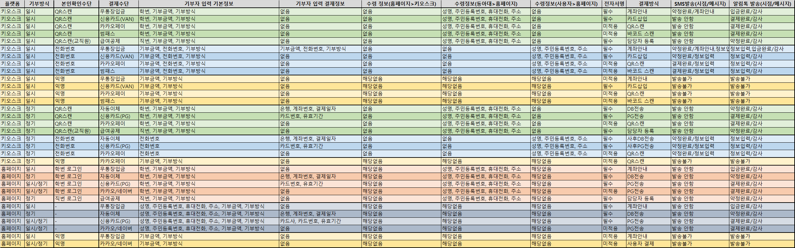

## :zero: XD 디자인 가이드 문서   
### 업데이트 예정
- 바코드 스캔, 카드 사입시 위치알려주는 디자인 추가
- 전화번호 주소 등 정보 페이지 추가
- 무통장입금 선택 시 계좌안내 SMS 발송
- 결제수단 중 급여공제 추가
### 프로토 타입
- QR코드 모드  
https://xd.adobe.com/view/d6e5840b-81a8-4ae9-824b-e48f9038e902-83b6/
- 전화번호 모드  
https://xd.adobe.com/view/0e93af62-ed1d-49b2-bbdf-8b188ff8de02-5bc0/
- 전체페이지  
  https://xd.adobe.com/view/0e93af62-ed1d-49b2-bbdf-8b188ff8de02-5bc0/
# :blue_book: 목차
## [XD 가이드 문서](#zero-xd-가이드-문서)
# :one: Background
## 개요
키오스크 기부 단말기 제작 프로젝트입니다.  
생성된 정보는 기본적으로 동아대학교 발전기금 홈페이지로 전송됩니다.  
홈페이지에서는 홈페이지에서 생성된 정보와 키오스크에서 생성된 정보를 취합해 동아대학교 발전기금시스템 DB로 전송합니다.
키오스크는 본인인증 방식에 따라 모드가 나뉩니다.
최초 계획에서는 QR코드 인증, 전화번호 인증, 사진 인증방식을 구현하고자 하였고 현재까지 시안은 QR코드 인증, 전화번호 인증까지만 작업되었습니다.
## 약정과 결제
동아대학교는 기부행위 약정과 기부 두가지 단계로 나누어 인식하며 두가지 모두가 이루어졌을 때 기부가 완료되었다고 인식합니다.
### 약정
- 기부자가 기부 의사를 구두, 전화, 문서, 전자적 입력을 통해 밝히는 것입니다.  
  일반 상거래에서 주문, 주문서 입력, 계약서 작성과 유사합니다.
### 결제
- 기부자가 밝힌 기부의사에 따라 기부금을 납입 하는 것 입니다.  
  일반 상거래에서 결제의 의미와 동일 합니다.
### 개발방향
- 홈페이지, 키오스크 모두 불가피한 상황을 제외하고는 기부자의 약정과 결제가 한번에 이루어 지도록 개발해야 합니다.
## 과업지시서
과업지시서 링크입니다. 작업시 본 가이드와 함께 참고하시기 바랍니다.  [[과업지시서_2021-02-05_전자_모금함_도입_용역.pdf]](과업지시서/과업지시서_2021-02-05_전자_모금함_도입_용역.pdf)
## 결제
### 결제API
- 아임포트 (https://www.iamport.kr/)
  - 복수의 결제대행사 이용시 효율적 개발과 유지보수를 위해 아임포트 이용예정
  - 참고자료
    - 대시보드 https://admin.iamport.kr/users/login
    - 개발가이드 https://www.iamport.kr/getstarted
    - 연동매뉴얼 https://docs.iamport.kr/
    - Github https://github.com/iamport
    - API문서 https://api.iamport.kr/
    - 결제DEMO https://www.iamport.kr/demo
  - 적용대상
    - 나이스페이 PG, 카카오페이, 네이버페이

### 결제수단
전체 결제수단의 개요정보입니다. 상세적용은 홈페이지, 키오스크간 상이할 수 있으니 아래쪽 관련내용과 함께 참조하시기 바랍니다.
#### 기부방식별 결제수단

[엑셀파일: 기부방식별 결제수단 상세.xlsx](etc/기부방식별_결제수단_상세_2021-05-25.xlsx)
#### 자동이체
- 결제대행사: 금융결제원CMS
- 프로세스
  1. 관리자 약정내역 엑셀 다운로드(웹 관리자 페이지)
  2. 금융결제원 업로드
  3. 이체결과 관리자 웹 업로드
  4. 결제내역 
#### 신용카드 (PG, 정기결제)
- 결제대행사: 나이스페이(PG, 가입예정)
- REST API방식  
  https://docs.iamport.kr/implementation/subscription  
  https://github.com/iamport/iamport-manual/blob/master/%EB%B9%84%EC%9D%B8%EC%A6%9D%EA%B2%B0%EC%A0%9C/example/nice-request-billing-key.md
#### 신용카드 (현장 일시불 결제)
- 결제대행사: KSNet(VAN, 가입예정)
- KSNET 제공 결제모듈 이용
- 키오스크에서만 지원하는 결제 방식
- 기부자에게 할부 수수료가 발생하므로 할부결제 이용하지 않음  
  분납 이용하고자 하는 기부자는 신용카드 정기결제로 처리
#### 카카오페이 (일시/정기결제)
- 결제대행사: 카카오페이(PG, 가입예정)
- 아임포트 이용
  - 일시결제 https://github.com/iamport/iamport-manual/blob/master/%EC%9D%B8%EC%A6%9D%EA%B2%B0%EC%A0%9C/sample/kakao.md
  - 정기결제 https://github.com/iamport/iamport-manual/blob/master/%EB%B9%84%EC%9D%B8%EC%A6%9D%EA%B2%B0%EC%A0%9C/example/kakaopay-request-billing-key.md
- 참고자료  
  - 카카오페이 개발자 센터 https://developers.kakao.com/docs/latest/ko/kakaopay/common
- 유사 웹페이지 적용 사례
  - 서원대학교 발전기금 홈페이지 (일시/정기기부 적용) https://with.seowon.ac.kr/with/fund/step?menuId=MENU00353
  - 푸르메 재단 (일시기부 적용) https://purme.org/donation-apply

#### 썸패스 (일시결제)
- 결제대행사: 썸뱅크(직접 이체방식)
- 썸패스는 키오스크에만 적용 예정입니다.
- 결제완료 결과를 수신할 수 있는지 확인해야 합니다.
- 부산은행 디지털사업부와 관련 문서, API제공에 대한 협의 예정입니다.
- 홈페이지에 네이버페이 적용 불가시 썸패스 적용 가능여부 검토예정입니다.
#### 네이버페이 (일시/정기결제)
- 결제대행사: 네이버페이 (PG, 가입예정)
- 네이버페이는 홈페이지만 적용 예정입니다.
  - 향후 적용여부 판단계획(홈페이지)
    - 아임포트측과 협의 후 적용 가부 판단
    - 아임포트 적용 불가시 직접 네이버페이 구현 여부 판단
    - 네이버페이 최종 적용 불가 판단 시 썸패스의 웹페이지 적용여부를 검토
    - 네이버페이, 썸패스 모두 웹 적용 불가 판단시 웹은 두가지 모두 구현하지 않음
- 아임포트 이용
  - 일시결제 https://github.com/iamport/iamport-manual/blob/master/NAVERPAY/sample/naverpay-pg.md
  - 정기결제 https://github.com/iamport/iamport-manual/blob/master/NAVERPAY/sample/naverpay-recurring.md
- 참고자료
  - 네이버페이 개발자 센터  
  일시결제 https://developer.pay.naver.com/docs/v2/api#payments-payments_flow  
  정기결제 https://developer.pay.naver.com/docs/v2/api#recurrent-recurrent_summary
- 유사 웹페이지 적용 사례
  - 굿네이버스 https://www.goodneighbors.kr/support_pay/regular.gn
  - 유니세프 https://www.unicef.or.kr/donation/?TrackCode=pc_donation_btn
  
## 기부자 인증 방식
### QRCode 모드
QRCode 모드는 기부자가 스캔한 모바일 학생증/직원 신분증에서 얻은 학번/직번 값을 통해 결제에 필요한 정보를 가져와서 기부자가 입력한 정보와 조합하여 현장에서 즉시 기부약정/결제처리 되는 방식입니다.
### 전화번호 모드
전화번호 모드는 기부자가 전화번호, 결제정보만 입력하여 약정을 완료하고 사용자가 입력한 전화번호로 SMS를 발송하여 사용자가 나머지 정보를 입력하게 유도해 사용자가 최종적 정보를 입력한 이후에 결제되는 방식입니다. VAN 결제는 현장에서 결제 처리 합니다.
## 홈페이지와의 연동
### 홈페이지 개발 정보
- 발전기금 홈페이지 프로토 타입 https://xd.adobe.com/view/26be83b6-2348-4c67-ab75-79010b78b03e-73ed/
- 발전기금 홈페이지 개발자 가이드 https://github.com/fund-donga/web_renewal/blob/main/Dev_guide.md
### 기본 통신방식
- 프로토콜 http, 형식 json
- 참고자료 https://stackoverflow.com/questions/5725430/http-test-server-accepting-get-post-requests
### 홈페이지 - 키오스크 연동 상세
- 홈페이지
  - 키오스크가 제출하는 약정/결제정보를 수신하고 불완전정보일 경우 약정서를 완성할 수 있는 URL을 키오스크에 리턴해 줍니다.
- 키오스크
  - 홈페이지에 카드사 식별을 위한 BIN 정보를 제공합니다.
  - 홈페이지에 약정/결제정보를 송신합니다. 불완전정보일 경우 리턴되는 URL을 기부자에게 문자메세지로 발송해서 기부자가 정보를 완성할 수 있게 합니다.
# :two: 기능별 개발 가이드
## QRCode 신분증 인식
- 동아대학교 학생증/교직원 신분증 APP상 QR코드를 리딩하면 암호화된 값을 읽을 수 있음
- QRCode 값 호출
  - http://idcard.donga.ac.kr/dongacard/qrdecode  
Type : POST  
Parameter : decode  
ex) http://idcard.donga.ac.kr/dongacard/qrdecode?decode=CAFF847E36E50C206D333FE4D9345C14735DC19876653DED4262CB65E7C2F833
  -  Response Json [학번:년월일시분초]

## 기부내역 송수신
키오스크는 기부내역을 1회 홈페이지로 송신합니다.  
원칙적으로 키오스크는 약정정보와 결제정보를 함께 키오스크로 송신하고 홈페이지는 약정정보가 불완전 할 경우 사용자가 정보를 완성할 수 있는 URL을 키오스크에 리턴합니다.  
결제정보가 없이 송신되었을 경우 결제는 홈페이지에서 처리합니다.

### 약정
- 키오스크에서 기부 약정이 완료되면 키오스크 약정번호와 약정정보가 생성되어야 합니다.
- 키오스크가 약정서를 홈페이지로 송신하면 홈페이지는 수신 웹 약정번호를 부여하고 불완전데이터일 경우 웹약정번호 URL을 리턴해 줍니다.
- 리턴받은 URL 처리 (키오스크)
  - URL을 QR코드로 변환해 기기 화면에 출력해서 사용자가 접근하여 완성 할 수 있게 합니다.
  - SMS로 URL을 발송해 사용자가 정보를 완성 할 수 있게 합니다.
### 결제
- 키오스크에서 기부 결제가 완료되면 키오스크 결제번호가 생성되어야 합니다.
- 결제 승인번호는 약정시 생성된 키오스크 약정번호에 종속됩니다.
### 전자서명
- 사용자가 작성한 전자서명파일은 sign_키오스크약정번호.png 와 같은 형태로 저장하여 파일명을 홈페이지로 전송하여야 합니다.
- 홈페이지는 해당 파일을 홈페이지에서 작성된 전자서명과 함께 보관하여야 합니다.
## SMS 발신
기부방식별 결제수단 상세 안내에 따라 무통장입금 기부자와 불완전정보 입력 기부자에게 문자메세지를 발송 하여야 합니다. 
- 메세지 구분
  - 무통장입금: 계좌안내 메세지
  - 불완전정보: 정보 입력 안내 메세지
- 구현
  - 링크허브 SMS SDK로 구현 https://www.linkhub.co.kr/Downloads/SMS/79?PageNum=1
- [기부방식별 결제수단 참고](#기부방식별-결제수단)
## BIN 정보제공
키오스크는 KSNet 기준 최신 BIN정보를 보유하여야 합니다.  
홈페이지가 일정 주기로 BIN정보 업데이트를 요청할 경우 BIN정보를 Json값으로 리턴해주어야 합니다.
## 기기설정
- 키오스크는 각각 기기의 일련번호를 가지고 홈페이지에 등록된 설정값을 가져옵니다. (로컬보다 웹 우선)
- 통신
  - 기기 설정시 홈페이지의 기기 일련번호의 설정값을 요청하고 받아와서 처리합니다.
  - 매 3분마다 기기설정이 변경되었는지 확인하기 위해 홈페이지에 요청값을 발송합니다.
  - 관리자가 직접 홈페이지의 설정을 가져올 수 있어야 합니다.
- 홈페이지
  - 홈페이지는 각 기기가 7분이 지나도 설정값 확인 요청 갱신이 없으면 기기가 OFFLINE 된 것으로 인식합니다.
- 키오스크가 홈페이지로 부터 불러올 설정값
  - 기기별 설정
    - 기기 일련번호
    - 활성화 여부 (ONLINE/OFFLINE)
    - 모금프로그램 설정
    - 인증방식 설정 (QRCode 모드, 전화번호 모드)
    - 테마설정 4가지
    - 초기 영상/이미지 설정
    - 관리자 설정
## 기부금 결제처리
### 무통장입금
- [기부방식별 결제수단 참고](#기부방식별-결제수단)
### 자동이체
- [기부방식별 결제수단 참고](#기부방식별-결제수단)
### 신용카드 정기결제
- 기부자가 입력한 카드번호로 BIN 정보 조회하여 카드사는 자동으로 식별합니다.
- 참고자료 https://www.ksnet.co.kr/Bbs/Details/?id=2806&ci=NOTICE&c=NOTICE&f=ALL&q=BIN4
### 신용카드 일시결제 VAN 구현
- [기부방식별 결제수단 참고](#기부방식별-결제수단)
### 썸패스 구현
- 썸패스 바코드 방식 구현
- 썸패스 결제성공시 알림 방식 확인 필요
- 참고자료
  - https://youtu.be/0asvCQThWNw?t=54
### 카카오페이 구현
- 일반사항 카카오페이 개발자 문서 참고
- 결제진행 단계에서의 QR코드
  - 일반적 개발단에서 문제점
    - WINDOWS 환경 기기에서 user-agent가 PC로 설정되면 웹 새창이 뜨게되면서 기기 컨트롤이 어려움
  - 개발방향
    - 제한된 환경에서 결제를 진행시키기 위해 카카오페이 결제준비 API Request시 Response 값 중 next_redirect_mobile_url 값을 QR코드로 자체변환하여 기기에 출력

  - 참고자료
    - 키오스크에서 카카오페이 아임포트 적용관련 문의내용 [[kiosk-kakaopay.md]](kiosk-kakaopay.md)
    - https://developers.kakao.com/docs/latest/ko/kakaopay/subscription
    - https://devtalk.kakao.com/t/topic/90538

# 제거된 기능
- 휴대폰 결제
- 사진 인증을 통한 기부
- 직번/학번 입력 인증을 통한 기부